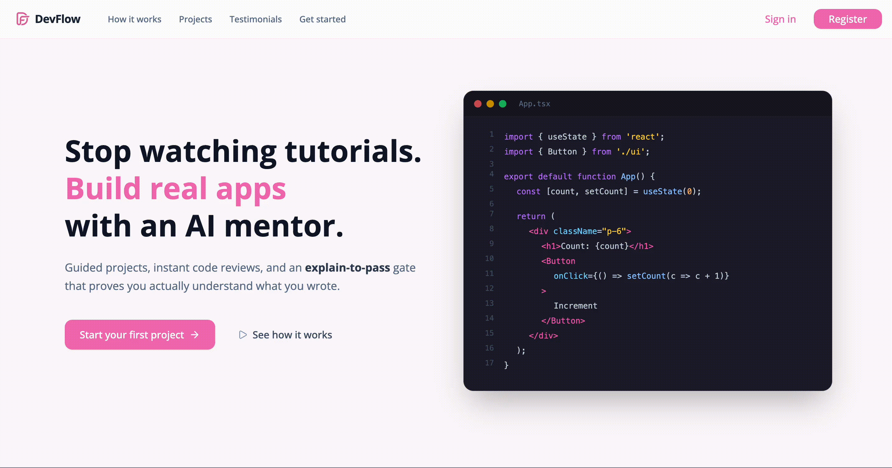
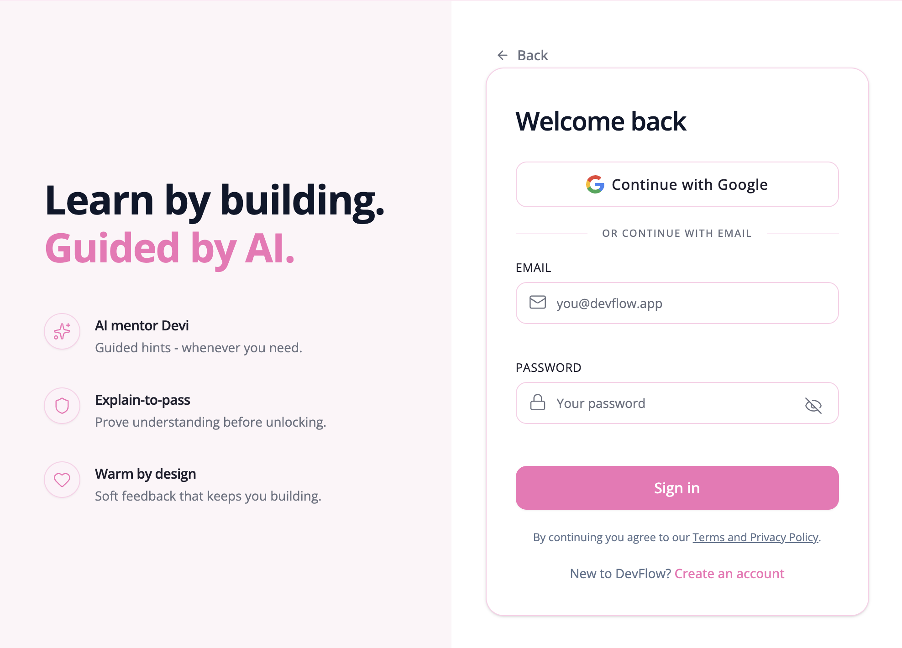
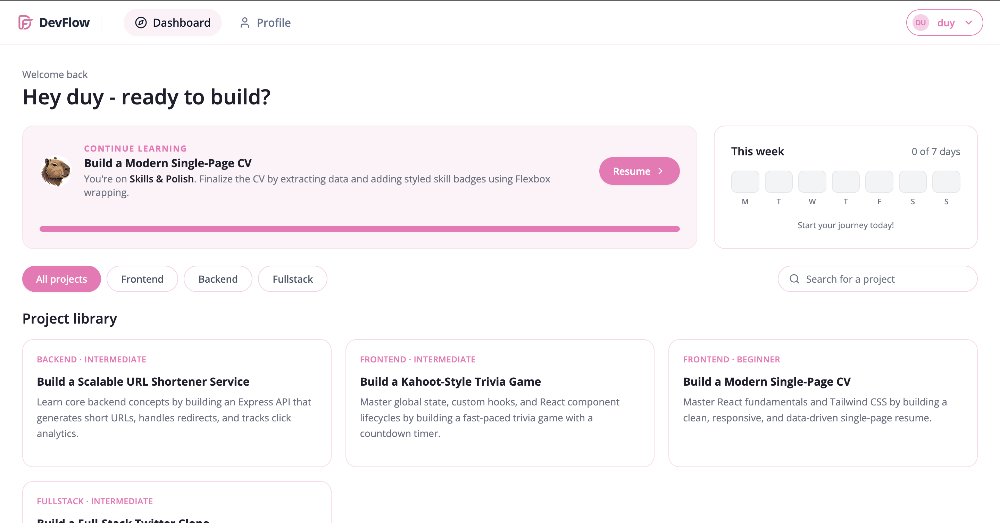
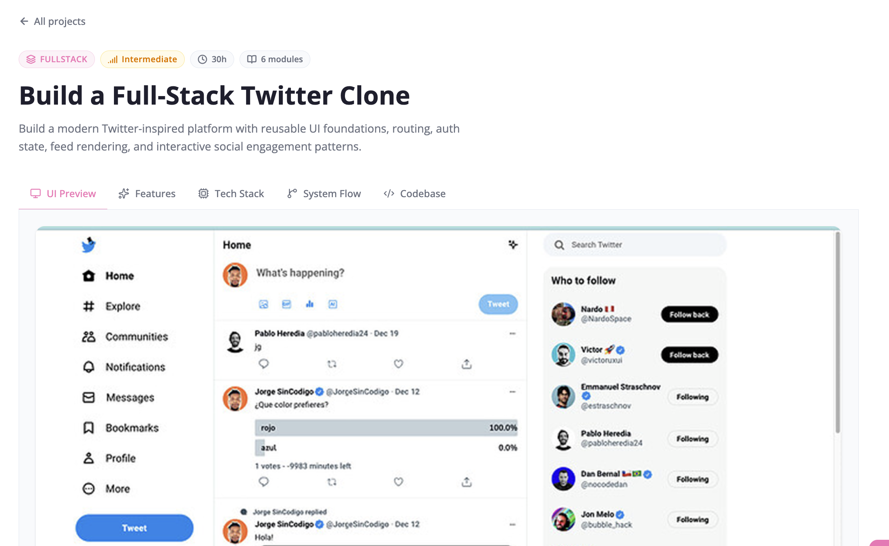
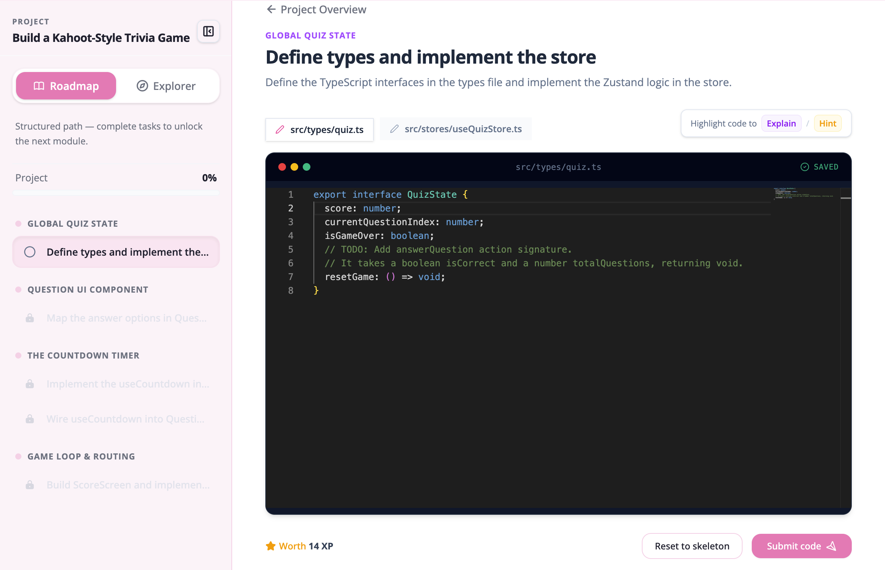
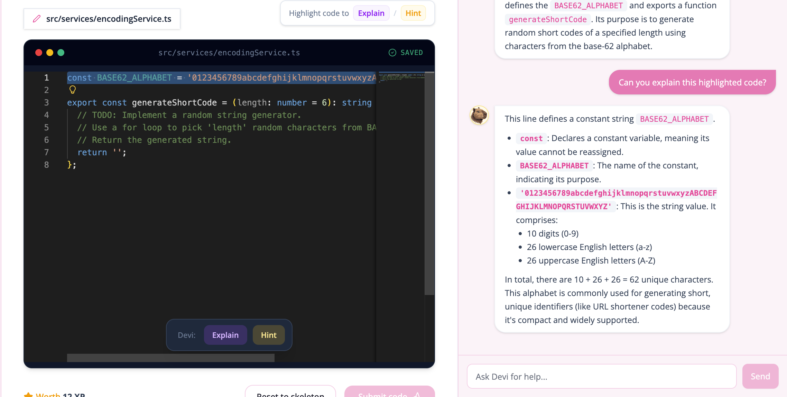
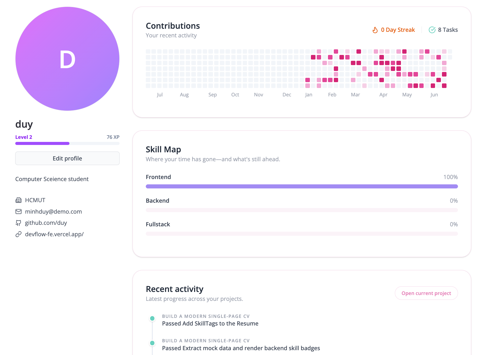

<div align="center">
  
  <h1> DevFlow Frontend Client</h1>
  <p>The interactive, real-time workspace for the DevFlow learning platform.</p>
  
  <a href="https://github.com/onfire-devcamp/devflow-be"><b>🔗 View the Backend Repository</b></a>
  <br />
  <br />


</div>

---

<details>
  <summary><b>📖 Table of Contents</b></summary>
  
  - [Overview](#overview)
  - [Features & Showcase](#features--showcase)
  - [Tech Stack](#tech-stack)
  - [Project Architecture](#project-architecture)
  - [Performances & SEO](#performances--seo)
  - [Project Structure](#project-structure)
  - [Getting Started](#getting-started)
  - [Contributors](#contributors)
  - [License & Feedback](#license--feedback)
</details>

## Overview

The DevFlow Frontend Client is a high-performance Single Page Application (SPA) designed to solve the "Tutorial Hell" problem by providing learners with a robust, in-browser IDE. Built on React 19 and Vite 8, the frontend prioritizes rapid UI rendering, managing complex global state for authentication, project tracking, and mastery-based progression without compromising frame rates.

At the core of the application lies the interactive coding workspace, seamlessly integrating the Monaco Editor with a real-time AI mentoring experience. By decoupling high-frequency keystroke events from React's rendering cycle and communicating directly with our stateless Node.js backend, the client delivers a smooth, low-latency environment where students can write code, submit it for evaluation, and receive context-aware, Socratic guidance on demand.

## Features & Showcase

### 1. 🔐 Seamless Authentication

The DevFlow Frontend ensures a secure and intuitive login and registration flow. By seamlessly integrating standard credentials alongside Google OAuth, it offers frictionless onboarding that allows users to quickly drop into their learning sessions without being bogged down by complex authentication steps.



### 2. 📊 Real-time Dashboard

Serving as the central hub of the application, the Interactive Dashboard allows users to easily track their mastery-based progression and daily streaks. From here, learners can review their overall achievements and select their specific learning roadmaps with just a click.



### 3. 🎯 Project Preview

Before diving into code, users are presented with a comprehensive Project Preview screen. This overview carefully details the task requirements, architectural expectations, and necessary prerequisites, ensuring the learner is fully prepared before transitioning to the workspace.



### 4. 💻 Interactive Workspace

The workspace deeply integrates `@monaco-editor/react` to provide a VS Code-like coding experience directly in the browser. It intelligently manages multi-file tasks by dynamically swapping the active model within a single Monaco instance based on the user's selected file tab. The editor runs entirely local-first, allowing users to rapidly iterate on their solutions.



### 5. 🤖 Context-Aware AI Mentor

Our AI mentor panel offers real-time, Socratic guidance without spoon-feeding answers. When a user asks a question, a custom React Query hook (`useDeviChat`) imperatively queries the Monaco Editor instance (e.g., `editorInstance.getValue()` and `editorInstance.getModel().uri`) to extract the precise `codeContext` and `currentFileName`. This zero-render data extraction ensures the AI receives perfect context of the user's work without triggering expensive UI updates.



### 6. 🧠 Explain-to-Pass System

Going beyond simple code correctness, our Explain-to-Pass system ensures true comprehension. Even if the submitted code passes unit tests, users must explain their underlying logic. The AI evaluates this explanation to confirm understanding before unlocking the next module, effectively preventing simple copy-paste progression.


### 7. 👤 User Profile

The dedicated User Profile page gives learners full visibility into their learning journey. It aggregates vital statistics, badges, and learning history, empowering users to view their achievements and manage their account details from a single, polished interface.



## Tech Stack

- **Core Framework:** React 19, Vite 8, TypeScript
- **Styling & UI:** Tailwind CSS v4, Lucide React (Icons)
- **Code Editor:** Monaco Editor (`@monaco-editor/react`)
- **Routing:** React Router DOM v7
- **State & Data Fetching:** Zustand, TanStack React Query v5, Axios
- **Form & Validation:** React Hook Form
- **SEO & Utils:** React Helmet Async, File Saver, JSZip, HTML-to-Image

## Project Architecture

The application strictly follows a "Bulletproof React" modular architecture. We enforce a unidirectional codebase where shared components and utilities remain decoupled, while domain-specific logic is encapsulated within feature modules (e.g., `features/auth`, `features/workspace`). This strict isolation prevents cross-feature contamination and scales cleanly.
To optimize rendering performance—especially in the workspace—we intentionally decouple high-frequency state from UI components. Network caching is managed entirely by React Query, global UI states (like Toasts) use Zustand, and the Monaco Editor's highly mutable code state is handled imperatively, ensuring React only re-renders when absolutely necessary.

## Performances & SEO

### Dynamic SEO & Open Graph

We manage SEO metadata utilizing `react-helmet-async` via a reusable `<SEO />` component. This allows us to dynamically inject route-specific `<title>` and `<meta>` tags across the SPA. For fallback sharing and social media previews (e.g., Twitter, LinkedIn), our baseline Open Graph tags and hero image (`og-image.jpg`) are hardcoded directly into the static `index.html`.

### Asset Optimization

Powered by Vite's Lightning-fast Hot Module Replacement (HMR), the development experience is incredibly fast. For production, we optimize our static assets and employ a lightweight CSS preloader directly in `index.html` to ensure rapid First Contentful Paint (FCP) and a perceived instant load while the React bundle downloads.

## Project Structure

```text
├── src/
│   ├── app/
│   │   ├── App.tsx
│   │   ├── index.css
│   ├── assets/
│   │   ├── logo.png
│   │   ├── mascot.png
│   │   └── ...
│   ├── components/
│   │   ├── Loading.tsx
│   │   ├── MarkdownRenderer/
│   │   ├── icons/
│   │   ├── seo/
│   │   └── ...
│   ├── config/
│   │   ├── paths.ts
│   ├── features/
│   │   ├── auth/
│   │   ├── dashboard/
│   │   ├── landing_page/
│   │   ├── profile/
│   │   └── ...
│   ├── lib/
│   │   ├── axiosClient.ts
│   │   ├── offlineSync.ts
│   ├── mocks/
│   │   ├── RoadmapData.tsx
│   ├── providers/
│   │   ├── AppProvider.tsx
│   ├── routes/
│   │   ├── PrivateRoute.tsx
│   │   ├── PublicRoute.tsx
│   │   ├── appRoutes.tsx
│   ├── stores/
│   │   ├── errorStore.ts
│   │   ├── offlineSyncStore.ts
│   │   ├── toastStore.ts
│   ├── types/
│   │   ├── auth.ts
│   ├── utils/
│   │   ├── exportUtils.ts
│   │   ├── fileIcons.tsx
│   │   ├── fileTreeUtils.ts
│   │   ├── form.ts
│   ├── .DS_Store
│   ├── main.tsx
```

## Getting Started

### Prerequisites

- Node.js (v20+ recommended)
- A running instance of the DevFlow Backend API.

### Installation & Local Dev

```bash
# Clone the repository
git clone https://github.com/onfire-devcamp/devflow-fe.git
cd devflow-fe

# Install dependencies
npm ci

# Setup environment variables
cp .env.example .env.local

# Run the Vite development server
npm run dev
```

### Environment Variables

| Variable                | Description                               | Example                                    |
| ----------------------- | ----------------------------------------- | ------------------------------------------ |
| `VITE_API_BASE_URL`     | The URL of the DevFlow Backend API        | `http://localhost:3000/api`                |
| `VITE_GOOGLE_CLIENT_ID` | Google OAuth Client ID for Authentication | `123456789-abc.apps.googleusercontent.com` |

## Contributors

<a href="https://github.com/onfire-devcamp/devflow-fe/graphs/contributors">
  
</a>

## License & Feedback

Distributed under the MIT License. If you have feedback or encounter issues, please open an issue in the repository.
